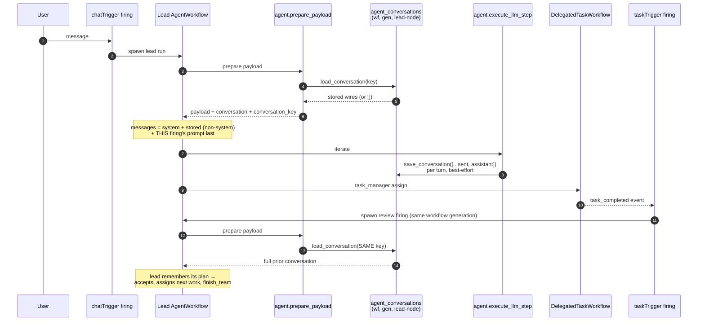

# Agent Context & Team Continuity Flow

Normative reference for how an agent's conversation survives across firings,
delegations, and rollovers — on both execution paths. Read this before
touching `services/agent_context/`, `nodes/context/`,
`services/cli_agent/context_bridge.py`, `agent.prepare_payload`,
`agent.execute_llm_step`, or the team-completion event chain. The invariants
at the bottom are the "do not break" contract; several were learned from a
production regression documented at the end.

Companion documents: [RFC-0002](../RFC-0002-AGENT-CONTEXT-AND-MEMORY.md)
(design rationale for Context vs Memory), [agent_teams.md](./agent_teams.md)
(team-lead contract), [TEMPORAL_ARCHITECTURE.md](./TEMPORAL_ARCHITECTURE.md)
(execution engine).

## The one-paragraph model

Context is **plain JSON messages**. One table, `agent_conversations`, keyed
by **`(workflow_id, generation, agent_node_id)`** → `messages` (a JSON list
of `MessageWire` dicts) + `updated_at`. A run **loads** the row at start and
**saves** the whole live message list back after every turn. Every firing of
an agent — chat messages AND taskTrigger completion reviews — continues the
one conversation; a workflow Reset admits a new generation, which is a new
key, which is a fresh conversation. The connected Context node is the
opt-in switch and the viewing panel, nothing more. This is the industry
pattern (LangGraph `thread_id`, OpenAI `conversation_id`, Claude Code
session files): a conversation id maps to a message list, and nothing else.

There are no threads, sessions, epochs, hash chains, checkpoints, blobs, or
operation ids. Memory (`simpleMemory`) is an ordinary tool — explicit
remember/recall — and plays no automatic part in continuity.

## The store (`services/agent_context/`)

| Function | Contract |
|---|---|
| `load_conversation(db, *, workflow_id, generation, agent_node_id) → List[Dict]` | The stored wires, `[]` when the key has no row. |
| `save_conversation(db, *, …, messages)` | Whole-list upsert under a per-key asyncio lock; stamps each message with a `ts` (UTC ISO — kept for the unchanged prefix, minted for the appended turn, view-only: `message_from_wire` ignores it); notifies listeners **after** the commit. |
| `clear_conversation(db, *, workflow_id, generation=None, agent_node_id=None) → int` | Deletes rows, optionally narrowed; returns the count. |
| `list_conversations(db, *, workflow_id)` | Panel metadata (`generation`, `agent_node_id`, `message_count`, `updated_at`), newest generation first. |

`listeners.py` carries `register_conversation_listener` /
`notify_conversation_saved`. The store never imports `nodes/`; the Context
plugin registers its `context.updated` broadcaster from
`nodes/context/__init__.py` — same layering as the other plugin registries.

## Full loop: chat → assign → child completes → review continues (Temporal path)



The review firing works **because the key is the same**: same workflow, same
generation, same lead agent node. No event routing, session lifting, or
thread resolution is involved — there is nothing to route.

## Message seeding: what a run's initial `messages` list is

```mermaid
flowchart TD
    R[AgentWorkflow run start] --> P{resume marker has<br/>carried transcript?}
    P -- "yes (continue-as-new)" --> C1["messages = carried transcript verbatim<br/>(exact live conversation, size-guarded ≤ 1 MB)"]
    P -- no --> Q{payload carries a stored<br/>conversation? (Context node,<br/>generation > 0, non-empty row)}
    Q -- yes --> C2["system (this firing's)<br/>+ stored wires minus system messages<br/>+ THIS firing's user prompt last"]
    Q -- no --> C3["bare build:<br/>system + memory markdown (legacy) + prompt"]
```

Precedence is exactly **carried transcript > stored conversation > bare
build** and is intentional:

- A rollover resumes the *same* run mid-flight — the live transcript is the
  truth and must win over any store read.
- A fresh firing with a Context node continues the *conversation* — the
  stored row is the truth.
- The bare build is the cold-start floor.

The carried transcript caps at ~1 MB serialized
(`_CAN_TRANSCRIPT_MAX_BYTES`) because Temporal's payload error limit is
2 MiB for the whole continue-as-new argument. Over the cap, the transcript is
dropped with a warning and the resumed run seeds like a fresh firing: from
the stored conversation when a Context node is connected (with the firing's
prompt appended again), else from the opening prompt.

A continue-as-new starts `run()` from the top, so `agent.prepare_payload`
runs again. The resumed run picks up the node's current configuration (tools,
system message, model) and reloads the stored conversation with the load
checks below, even when the carried transcript is what seeds it. If that
stored row is over the 1 MB seed cap, the resumed run fails with
`ConversationTooLarge`.

## Transcript size: capped results, cleared old results

The transcript is the `agent.execute_llm_step` input on every turn and the
row the next firing seeds from, so its size is bounded in bytes, not only in
tokens (the failure this prevents is `errors.md` #28: uncapped tool results
grew a saved row past the 1 MB seed cap and every later firing failed).

- **Tool results are capped before they enter the transcript.** Each
  external tool result is cut to `tool_result_max_chars` characters (per-user
  Settings > Tool Result Limit, else env `TOOL_RESULT_MAX_CHARS`, default
  100,000) with a note telling the model to call the tool again with narrower
  parameters (`services/tool_output.py`). Delegated agents' answers, skill
  loads and Task Manager results are never cut. Both paths apply it: the
  workflow right after `_serialise_tool_result`, the in-process loop in
  `run_native_agent_loop`.
- **Old results are cleared past a byte budget** (Temporal path).
  `agent.prepare_payload` records `transcript_budget_bytes` (three quarters of
  `TEMPORAL_PAYLOAD_WARN_BYTES`). After each tool turn over that budget,
  results from earlier turns become a short placeholder, oldest first and
  external tools first, down to half the budget. Each keeps its
  `tool_call_id` and `name`, so every call still has its answer. The saved
  conversation holds the placeholder too, and the store re-stamps that
  message's `ts` when it changes. If the latest turn alone still overflows,
  its external results are cut to one shared length
  (`services/temporal/agent_context_pressure.py`).
- **The rules are selected by the recorded payload.** `agent.prepare_payload`
  also records `context_pressure_version` and `tool_result_max_chars`; a run
  recorded before those keys existed replays the original rules (no cap,
  cumulative token gate, whole-transcript summary), because the rules decide
  which activities are scheduled. Any change to them needs a new version.

## Compaction: one system prompt, summary as a user message

Version 1 summarizes when the next request (the last request's
`total_tokens`, which every provider fills with the whole prompt including
cache reads, plus what the turn added) reaches the threshold, or when the
earlier turns alone keep the transcript over its byte budget. It sends
`agent.compact_context` only the turns before the latest one and swaps
`messages` for `[original system (verbatim), user("## Compacted
conversation summary" + summary + current request), latest turn verbatim]`:
the latest turn's tool results have not been read yet, so summarizing them
would lose what the model just asked for. With nothing older than the latest
turn, it skips (a summary of the opening alone gains nothing). Runs recorded
before version 1 keep the original rule: summarize everything when the
running sum of every step's usage crosses the threshold. Two rules are
load-bearing (locked by
`TestConversationIdentity::test_compaction_preserves_the_system_prompt_and_summary_survival`):

- **The system prompt is never modified or duplicated.** It is the agent's
  contract (personality + tool/delegation guidance) and must stay
  byte-stable — for provider prompt caching, and because the next firing's
  seeding drops stored system messages so policy changes take effect.
  Anything compaction stores under the system role therefore silently
  vanishes on the next firing; that is exactly how an earlier
  second-system-message design lost the summary on the next chat message
  while the noisy tool tail (non-system) outlived it.
- **The summary rides a user message**, so the compacted knowledge persists
  through seeding and crosses firings with the conversation it summarizes.

Tool calls/results from the summarized turns are dropped from the live list
at the swap; they survive only inside the summary text. Tool messages that
appear *after* the summary in the panel are the kept latest turn or **new
work the agent did post-compaction**, not survivors of the summarized turns.
The trigger (projected tokens against the threshold, transcript bytes against
the budget), the applied swap (before → after counts, summary size, kept
messages), each clear and each cut log at INFO, as does the activity
(rendered chars in, summary chars + summarizer usage out). A summarizer
failure after the activity's retries is terminal for the run
(`CompactionError`), not best-effort: past that point the transcript could
only grow until the provider rejected it.

- **Load failures raise.** `agent.prepare_payload` raises
  `ApplicationError("ConversationLoadFailed")` (retryable) when the row
  cannot be read, and `ApplicationError("ConversationTooLarge")`
  (non-retryable, `_SEED_TRANSCRIPT_MAX_BYTES` = 1 MB; the message sends the
  user to the Context panel and the Tool Result Limit) when it is oversized.
  Running on silently instead would burn tokens on an amnesiac prompt — the
  exact failure mode this design replaced. With the cap and the byte budget
  above, new transcripts stay far below the limit; a row saved before them
  needs one clear. Both error types and the 1 MB cap exist only on the
  Temporal path. The in-process `_prepare_context` (`services/ai.py`) and
  `SpecializedAgentContextBridge.resolve` also refuse to run after a failed
  load, but raise a plain `ValueError`, and they load a row of any size.
- **Save failures warn and continue.** The save happens *after* the
  provider was called and billed, so raising there would fail a completed
  turn over a bookkeeping write. `_save_conversation`
  (`agent_activities.py`), the loop's `save_now()` (`agent_runtime.py`),
  and every specialized-provider `record_turn` call site swallow and log.
  `_save_conversation` also logs a WARNING when a saved row passes half of
  `_SEED_TRANSCRIPT_MAX_BYTES`, while the next firing can still load it.

## Both execution paths, one contract

| Path | Load | Save |
|---|---|---|
| Temporal (`AgentWorkflow`) | `agent.prepare_payload` loads and returns `conversation` + `conversation_key` | `agent.execute_llm_step` saves `[...sent, assistant]` after each provider call |
| In-process (`services/ai.py`) | `_prepare_context` builds `_AgentContextRuntime{key, history, database}` | the loop's `conversation_saver=runtime.save` fires after each assistant append and after tool results |
| Specialized providers (claude_code / codex / rlm / vertex) | `SpecializedAgentContextBridge.resolve` loads; `augment_prompt` renders the transcript into the prompt | `record_turn(original_prompt, response)` appends and saves — always the **original** prompt, never the augmented one, or the save nests the transcript inside itself |

The opt-in gate is identical everywhere: the edge-walker descriptor's
`kind == "context"` plus an admitted `generation > 0` (manual canvas Runs
persist nothing by design — only Start admits a generation).

For claude, the session-pool key is the conversation key
(`(workflow_id, agent_node_id, generation)` — `bridge.pool_key`), so a
Reset's generation bump automatically fences warm subprocesses at `acquire`
time, and a same-generation panel Clear terminates them explicitly
(`ClaudeSessionPool.terminate_conversations`).

## The Context node and panel

`nodes/context/` owns the opt-in descriptor (`_descriptor.py`), two WS
handlers (`get_agent_context` returns the **live generation only** —
`{conversations, generation, agent_node_id, updated_at, message_count,
messages}`, where `messages` is the requested `agent_node_id`'s transcript,
else the newest row's; `clear_agent_context` deletes rows and fences warm
claude processes), and one CloudEvents broadcast (`context.updated`, fired from the
registered save listener; payload is identity + count only — the panel
refetches through the authorized handler). Both ways of forgetting share
`_handlers.forget_conversations` (delete, fence warm claude processes,
announce). The plugin also registers `on_chat_cleared` with
`services/chat_thread.register_chat_cleared_listener`: when the owner clears
a workflow's chat (`clear_chat_messages` → `clear_chat_session`), every
conversation of that workflow goes too, so the agent starts over with the
chat. A Reset forgets them through the node's `reset_execution_state`, and
clears the chat thread through the chat nodes' own Reset hook. The node declares **no
parameters**; the connection is the whole configuration.

The node is optional and user-owned. `normalize_workflow_graph` never
creates, reconnects or deletes one; rewriting a legacy
`simpleMemory -> input-memory` edge is the one exception. Save never restores
a deleted Context, and `workflow_validator` accepts an agent without one: it
checks only the Context edges that exist (`INVALID_CONTEXT_EDGE`,
`MULTIPLE_CONTEXTS`, `SHARED_CONTEXT`), and `handle_save_workflow` refuses a
graph with any of them (`invalid_context_topology`). A Context node therefore
serves exactly one agent. A leftover `simpleMemory -> input-memory` edge only
produces a `LEGACY_MEMORY_EDGE` warning. Deleting the node is the opt-out.

**Known gap: the panel is not narrowed to its own agent.** `get_agent_context`
lists every stored conversation in the workflow's live generation, not only
the one for the agent wired to this Context node. In a workflow with two
agents, each on its own Context node, each panel lists both agents in its
selector and opens on the newest row, which can be the other agent's; the
badge shows whose conversation it is. Clearing from the panel clears the
agent currently shown.

The panel ([`ContextPanel.tsx`](../client/src/components/parameterPanel/ContextPanel.tsx))
renders role-tinted message cards with per-message `ts` timestamps, routes
JSON-shaped payloads (tool calls, tool results) through the themed JSON
tree on the per-theme `--code-*` surface, and offers a **Raw** tab showing
the stored wires verbatim. It declares `refetchOnMount: 'always'` because
the app's global `refetchOnMount: false` default would render stale cache
when the panel opens after a run that mutated the conversation while no
observer was mounted.

**Reset wipes.** `AgentContextNode.reset_execution_state` clears every
stored conversation for the workflow, terminates warm claude subprocesses
holding the wiped transcript, and broadcasts `context.updated` so open
panels refresh. The generation bump alone is NOT enough: the panel shows
the newest STORED generation, so surviving rows would keep rendering the
pre-Reset conversation as the live context and Reset would look like a
no-op. A plain Stop → Start (new generation without Reset) leaves prior
rows in the store as inert history — deliberately **not browsable from
the panel**, which shows only the agent's current context — until Reset
runs or the archive-outbox drain in `services/workflow_storage/handlers.py`
clears them. The drain runs when the workflow is deleted AND when a save
removes a Context node, and it clears every stored conversation of the
workflow, not only the removed Context's agent.

## Invariants (do not break)

| # | Invariant | Why |
|---|---|---|
| 1 | The store observes; it never steers. Requests are always built from `messages`; `conversation_key` only says where to save. | The original `context_ref` regression made attaching a Context node change what the agent sent. |
| 2 | One key per agent per generation: `(workflow_id, generation, agent_node_id)`. Every firing — chat or task review — continues that one conversation. | Per-firing/per-session keys are how the lead came back amnesiac (`messages=2`). |
| 3 | Seeding precedence: carried transcript > stored conversation > bare build. | Rollover mid-run truth beats the store; the store beats cold start. |
| 4 | Load failures are LOUD (`ConversationLoadFailed` / `ConversationTooLarge` on Temporal; a `ValueError` on the in-process and specialized paths, which have no size cap); save failures are best-effort. | Never burn tokens on an amnesiac prompt; never fail a billed turn over bookkeeping. |
| 5 | Save the exact sent list, after the provider call. Nothing writes to the store before a request exists. | The journal's `prepare_context` wrote fabricated requests assembled from configuration. |
| 6 | Reset = new generation = new key, AND the Context node's reset hook clears the workflow's stored rows. | The panel shows the newest stored generation, so surviving rows make Reset look like a no-op. |
| 7 | `input-memory` is retired; the conversation store is the continuity carrier. Do not resurrect markdown seeding. | `normalize_workflow_graph` migrates it away and the validator warns on any left (`LEGACY_MEMORY_EDGE`); two carriers would drift. |
| 8 | Specialized bridges record the ORIGINAL prompt, never the augmented one. | Recording the rendered transcript nests the conversation inside itself and grows without bound. |
| 9 | The store never imports `nodes/`; the plugin registers its broadcaster via `register_conversation_listener`, and a listener failure can never fail a save. | Same layering rule as every plugin registry; a UI notification must not break execution. |
| 10 | External tool results are capped before they enter the transcript; the latest turn is never cleared or summarized; the pressure rules are chosen by the recorded `context_pressure_version`. | Uncapped results bricked every later firing (`errors.md` #28); an unread turn summarized away loses what the model asked for; a replay must schedule the commands it recorded. |

## How this broke (August 2026 regression), and why the journal went away

Symptom: a team lead re-invoked by a `taskTrigger` completion started at
`messages=2`, accepted the task, and returned — "forgot its plan" — after a
Context node was added.

The original carrier was an append-only **journal** (7 tables: threads,
hash-chained events, checkpoints, blobs, provider bindings, epochs) with
per-firing operation ids and session/task/execution thread resolution. It
failed twice in the same direction: the Temporal path was write-only (fresh
firings never read the journal back), and completion firings resolved a
different thread than the chat that started the work. Both were patched —
and the patched system still carried thread routing, epoch fencing, and
reconstruction machinery whose only job was to approximate "one agent, one
conversation".

The replacement makes that property structural instead of routed: the
conversation key **is** workflow + generation + agent node, so a firing
cannot land in the wrong conversation because there is no resolution step
to get wrong. When an agent "ignores" its guidance, check what its
`messages` list actually contained first.
