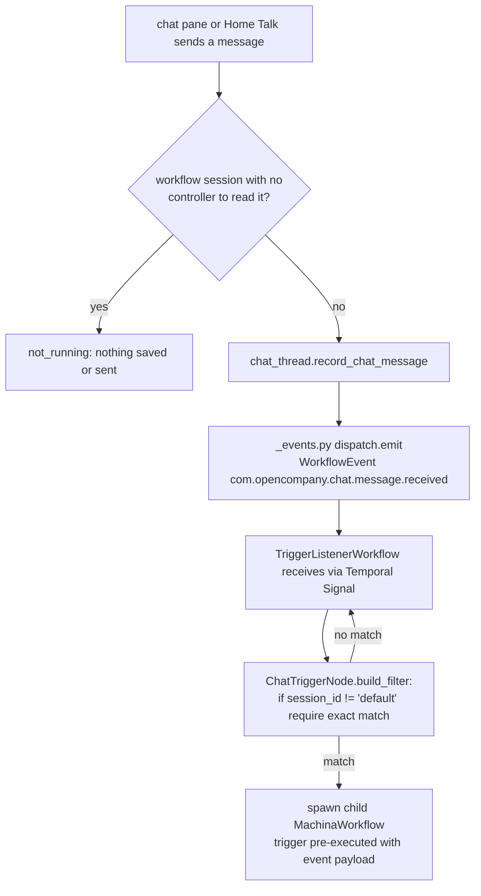

# Chat Trigger (`chatTrigger`)

| Field | Value |
|------|-------|
| **Category** | workflow / trigger / utility |
| **Backend handler** | Plugin [`server/nodes/trigger/chat_trigger/__init__.py`](../../../server/nodes/trigger/chat_trigger/__init__.py) (`ChatTriggerNode`); dispatch via `BaseNode.execute()`. The base `TriggerNode.execute` handles the event-waiter wait — the `@Operation("wait")` body is a stub. The generic legacy path is [`server/services/handlers/triggers.py::handle_trigger_node`](../../../server/services/handlers/triggers.py) (reachable only for the lone deferred-canary trigger, not chatTrigger). |
| **Tests** | [`server/tests/nodes/test_workflow_triggers.py`](../../../server/tests/nodes/test_workflow_triggers.py) |
| **Skill (if any)** | none |
| **Dual-purpose tool** | no |

## Purpose

Fires when the user sends a chat message: from the editor's chat pane
(Console Panel chat tab), or from Talk on an employee's Home page. The
producer [`server/nodes/trigger/chat_trigger/_events.py`](../../../server/nodes/trigger/chat_trigger/_events.py)
emits a CloudEvents `WorkflowEvent` (`type: com.opencompany.chat.message.received`)
via `dispatch.emit`. `chatTrigger` is canary-registered
(`register_canary_trigger_type`), so `DeploymentManager` starts a
`TriggerListenerWorkflow` for it; the listener receives the event via Temporal
Signal and spawns a child `MachinaWorkflow` per matching event. Any `chatTrigger`
node whose `session_id` matches (or is `'default'`) receives the event and emits
it as output. This is the primary way a user feeds an interactive prompt into an
`aiAgent` or `chatAgent`.

A workflow's chat session id is the workflow id. Home's Talk and the editor's
chat pane send with `session_id` = that id (`'default'` only when the editor
has no workflow open), and `send_chat_message` then scopes the event to the
workflow (`EventWorkflowId`), so only that workflow's listeners receive it.
The trigger of a talk line (a chat hire's "Chat" trigger, or the "Talk"
trigger that Hire and Turn on Talk add beside another worker) has
`session_id` set to the workflow id, and its agent answers through
[`chatReply`](../chat_utility/chatReply.md) into the same thread. See
[Normal mode → Talk](../../normal_mode.md#talk).

## Inputs (handles)

| Handle | Connection type | Required | Purpose |
|--------|-----------------|----------|---------|
| (none) | - | - | Trigger nodes have no inputs. |

## Parameters

| Name | Type | Default | Required | displayOptions.show | Description |
|------|------|---------|----------|---------------------|-------------|
| `session_id` | string | `default` | no | - | Matches the `session_id` on the incoming chat event. If set to `default`, the filter accepts every event. Otherwise it only accepts events with the same `session_id`. Talk lines built by Hire and Turn on Talk use the workflow id. |
| `placeholder` | string | `Type a message...` | no | - | Frontend display only - not used by the handler. |

## Outputs (handles)

| Handle | Shape | Description |
|--------|-------|-------------|
| `output-main` | object | The chat event payload (see below). |

### Output payload

`routers/websocket.py::handle_send_chat_message` builds the event as:

```ts
{
  message: string;
  timestamp: string;   // ISO 8601; the client's, else the server's time (UTC)
  session_id: string;
}
```

Wrapped in the standard envelope.

## Logic Flow



## Decision Logic

- **Filter** (`ChatTriggerNode.build_filter`):
  ```python
  if session_id and session_id != 'default':
      return event.get('session_id') == session_id
  return True
  ```
  So `session_id='default'` (the frontend default) is a wildcard - the
  trigger fires for every chat message regardless of which session the user
  is in.
- **Cancellation**: yields `success=False, error="Cancelled by user"`.

## Side Effects

- **Database writes**: none while it fires. (`send_chat_message` keeps the
  message in the session's thread first, through
  `services/chat_thread.record_chat_message`, which stamps the live generation
  and broadcasts `chat.updated`.) On a workflow Reset its
  `reset_execution_state` clears the workflow's own thread (session = the
  workflow id, never a custom `session_id` another workflow may share),
  as `chatReply`'s does: the conversation ended with the generation. It
  matters for a graph with a trigger and no reply yet, such as the one
  Turn on Talk resets before its new reply node runs.
- **Broadcasts**: the producer emits a CloudEvents `WorkflowEvent` via
  `dispatch.emit` (Temporal Signal fan-out + in-process WS broadcast). The
  `TriggerListenerWorkflow` emits firing-pulse status via
  `broadcast_trigger_status_activity` before/after each child spawn.
- **External API calls**: none.
- **File I/O**: none.
- **Subprocess**: none.

## External Dependencies

- **Credentials**: none.
- **Services**: `services.event_waiter`, `services.status_broadcaster`.
- **Python packages**: stdlib only.
- **Environment variables**: none.

## Edge cases & known limits

- `session_id='default'` behaves as a wildcard; setting a unique session ID
  per trigger is the only way to scope messages to a specific node.
- When multiple `chatTrigger` nodes exist with the same session ID, all of
  them fire for a matching message, so one message starts one run per
  trigger. Hire and Turn on Talk never add a second trigger on a workflow's
  own session: a chat hire's "Chat" trigger is already its talk line.
- The handler has no timeout; it waits forever until an event arrives or
  the run is cancelled.
- For a workflow's session, `send_chat_message` first reads the latest
  control. While it runs, starts or resumes, the message goes now (response
  `delivery: "now"`); while it is paused or pausing, the controller keeps it
  and starts a run on Resume (`delivery: "queued"`). In any other state the
  handler answers `not_running` and neither saves nor dispatches the message.
  Session `'default'` is saved and dispatched as before, so a message there is
  stored even when no `chatTrigger` is waiting.

## Related

- **Skills using this as a tool**: none.
- **Sibling triggers**: [`webhookTrigger`](./webhookTrigger.md),
  [`taskTrigger`](./taskTrigger.md).
- **Answers into the thread**: [`chatReply`](../chat_utility/chatReply.md).
- **Architecture docs**: [Event Waiter System](../../event_waiter_system.md),
  [Status Broadcaster](../../status_broadcaster.md),
  [Normal mode → Talk](../../normal_mode.md#talk)
